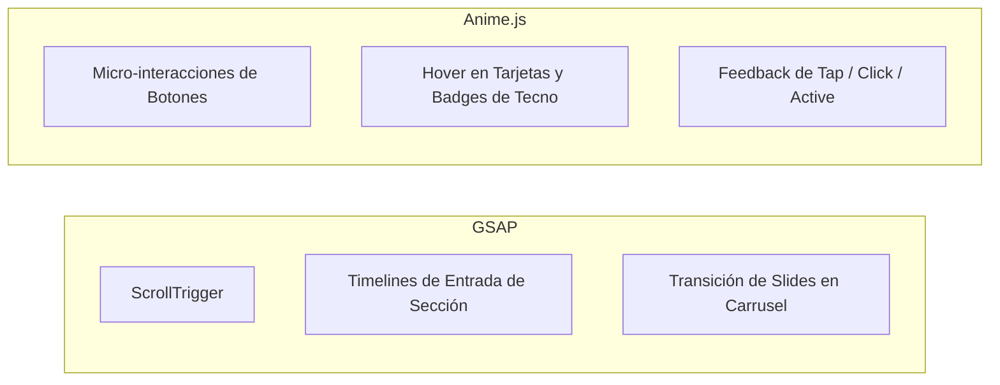

# Reglas de Animación (`model/animation-rules.md`)

Este documento establece la distribución de responsabilidades, convenciones técnicas y consideraciones de accesibilidad para todas las animaciones del portafolio.

---

## 1. Reparto de Responsabilidades

Para mantener un rendimiento óptimo y una separación clara de concerns en el renderizado, se divide el trabajo de animación entre dos bibliotecas principales:



### GSAP (GreenSock Animation Platform)
- **Casos de uso exclusivos**:
  - `ScrollTrigger` para detectar la entrada y salida de paneles/secciones en el viewport.
  - Timelines orquestadas de entrada (`gsap.timeline()`) para elementos con escalonamiento (*stagger*) en la carga de vistas.
  - Core de interpolación y transiciones de slides del carrusel de proyectos destacados.
- **Buenas prácticas**:
  - Limpiar siempre instancias o ScrollTriggers en el hook `onUnmounted` de Vue para evitar fugas de memoria.
  - Usar propiedades optimizadas para composición por GPU (`transform`, `opacity`, `scale`).

### Anime.js
- **Casos de uso exclusivos**:
  - Micro-interacciones interactivas en elementos pequeños (efecto magnético o pulsación en `Boton.vue`, bounce sutil en iconos de tecnologías en `Tecno.vue`).
  - Animaciones reactivas a eventos rápidos del usuario (`mouseenter`, `mouseleave`, `mousedown`, `touchstart`).
- **Buenas prácticas**:
  - Instanciar animaciones ligeras con duraciones cortas (150ms - 350ms) y easings fluidos (`easeOutQuad`, `spring`, `cubicBezier`).

---

## 2. Accesibilidad y Rendimiento (`prefers-reduced-motion`)

- **Regla Inquebrantable**: Todo efecto cinético debe respetar la configuración del sistema del usuario para reducción de movimiento.
- **Implementación**:
  - Verificar en JavaScript: `window.matchMedia('(prefers-reduced-motion: reduce)').matches`.
  - Si la reducción está activada, las animaciones deben deshabilitarse o reducirse a una transición instantánea de opacidad simple sin desplazamientos (`translateX/Y` o `scale` desactivados).
- **CSS**:
  ```css
  @media (prefers-reduced-motion: reduce) {
    *, ::before, ::after {
      animation-duration: 0.01ms !important;
      animation-iteration-count: 1 !important;
      transition-duration: 0.01ms !important;
      scroll-behavior: auto !important;
    }
  }
  ```
